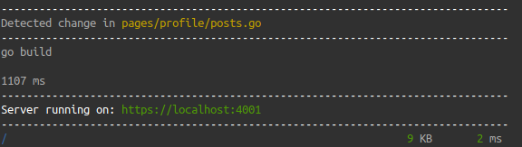

# run

[![Godoc][godoc-image]][godoc-url]
[![Report][report-image]][report-url]
[![Tests][tests-image]][tests-url]
[![Coverage][coverage-image]][coverage-url]
[![Sponsor][sponsor-image]][sponsor-url]

Runs an [Aero](https://github.com/aerogo/aero) project and restarts on code/template/style changes.



## Requirements

[pack](https://github.com/aerogo/pack) needs to be installed:

```shell
go get -u github.com/aerogo/pack/...
```

## Installation

```shell
go get -u github.com/aerogo/run/...
```

## Usage

```shell
run
```

## Style

Please take a look at the [style guidelines](https://github.com/akyoto/quality/blob/master/STYLE.md) if you'd like to make a pull request.

## Sponsors

| [](https://github.com/cedricfung) | [](https://github.com/soulcramer) | [](https://eduardurbach.com) |
| --- | --- | --- |
| [Cedric Fung](https://github.com/cedricfung) | [Scott Rayapoullé](https://github.com/soulcramer) | [Eduard Urbach](https://eduardurbach.com) |

Want to see [your own name here?](https://github.com/users/akyoto/sponsorship)

[godoc-image]: https://godoc.org/github.com/aerogo/run?status.svg
[godoc-url]: https://godoc.org/github.com/aerogo/run
[report-image]: https://goreportcard.com/badge/github.com/aerogo/run
[report-url]: https://goreportcard.com/report/github.com/aerogo/run
[tests-image]: https://cloud.drone.io/api/badges/aerogo/run/status.svg
[tests-url]: https://cloud.drone.io/aerogo/run
[coverage-image]: https://codecov.io/gh/aerogo/run/graph/badge.svg
[coverage-url]: https://codecov.io/gh/aerogo/run
[sponsor-image]: https://img.shields.io/badge/github-donate-green.svg
[sponsor-url]: https://github.com/users/akyoto/sponsorship
